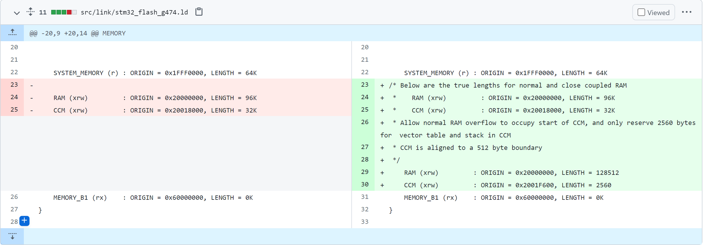

## Fix memory corruption caused by MSP_BOXNAMES buffer overflow.

https://github.com/betaflight/betaflight/issues/10896

https://github.com/betaflight/betaflight/pull/10897/files#diff-c04e3c1adc720c2f5ccdc800d081539d934d7778c0ccc291cc47acc8afca3782

Multiwii Serial Protocol (MSP)

Wrong estimate of the length of the command

```c
- #define MSP_PORT_OUTBUF_SIZE 256
+ #define MSP_PORT_OUTBUF_SIZE 320 // As of 2021/08/10 MSP_BOXNAMES generates a 307 byte response for page 1.
    
/* ... */

static mspPostProcessFnPtr mspSerialProcessReceivedCommand(mspPort_t *msp, mspProcessCommandFnPtr mspProcessCommandFn)
{
    static uint8_t outBuf[MSP_PORT_OUTBUF_SIZE];
    
    mspPacket_t reply = {
        
/* ... */
```

## Fix STM32G474 RAM overflow

https://github.com/betaflight/betaflight/pull/10720/files

link script error



