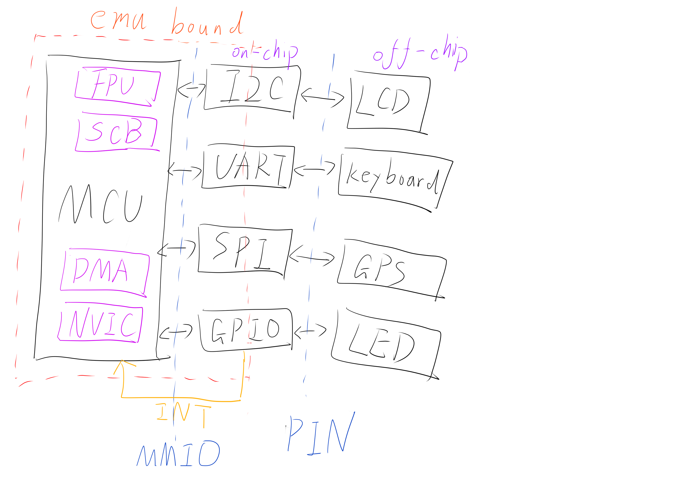

## Semi-automatic peripheral rehost

### Observation

- Emulate peripheral interface instead of peripheral.
- Many peripherals do not require precise simulation, just cheat the firmware !.
- There are not many types of peripherals, but the same peripherals are different on different platforms.

### Problem

- How to define the peripheral interface ?
- How to cheat firmware with less effort instead of reversing entire peripheral ?
- How to find the difference of peripherals in different platforms ?

### Design

- For firmware developer, they faced same problem. They use DOC + HAL to solve the problem.
- Symbolic execution on HAL, automatic extract the basic logic of peripheral interface.

### Examples

```c
uint8_t UART_Transmit(data) {
	huart->Instance->DR = data;
   	UART_WaitOnFlagUntilTimeout(huart, UART_FLAG_TC, RESET, tickstart, Timeout);
}
```

`Write DR` -> `Set TC bit`

### How to show the work?

Auto generate the peripheral code of STM32F1, F4, F7 series MCU, and open source them.

## Fuzzing on MCU emulator

### Difficulty

- The simulator currently only supports limit MCU, supporting more MCUs is not easy.
- The simulator is not fast.
- Too few open source projects, we can always fuzzing DIY firmware, and it is also difficult to fetch the real world commercial firmware.
- How we auto find the input/output channel of firmware? A firmware may have multi-input/output channel and the format also can be complex.
- How to define the crash/hang of firmware? Firmware crashes usually appear as an infinite loop or hard fault, but the normal running firmware may have the same situation.
- Fuzzing a MCU Lib is more difficult than fuzzing a firmware, because developers will tailor the library according to their own needs.


